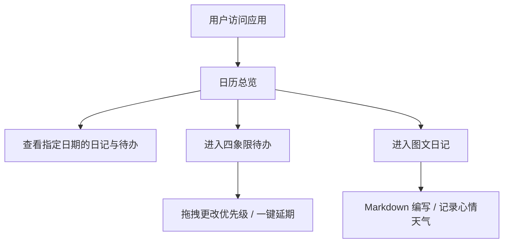

## 1. 产品概述
轻日记是一款集日历总览、四象限待办、图文日记于一体的个人管理工具。
- 帮助用户以日历为中心，清晰掌握每一天的状态、任务和心情，提升时间管理效率与生活记录体验。
- 产品定位为轻量级、高颜值、支持 Vercel 部署的现代化 Web 应用。

## 2. 核心功能

### 2.1 用户角色 (不适用)
- 本项目暂为纯前端展示，数据存储于本地，不涉及复杂的用户角色权限划分。

### 2.2 功能模块
1. **日历总览**：展示日历视图，选中日期显示对应的心情、天气、待办概览和日记信息。
2. **四象限待办**：基于重要紧急四象限法则的待办事项管理，支持拖拽、延期。
3. **图文日记**：支持 Markdown 编辑、图片上传/链接、心情和天气记录。

### 2.3 页面详情
| 页面名称 | 模块名称 | 功能描述 |
|-----------|-------------|---------------------|
| 日历页 | 概览模块 | 满屏或大画幅日历，点击特定日期联动展示该日的日记和待办情况 |
| 待办页 | 四象限模块 | 重要紧急/重要不紧急/不重要紧急/不重要不紧急四区块，支持拖放、增删改查、一键延期至次日 |
| 日记页 | 编辑与展示 | 支持 Markdown 输入，记录心情、天气，支持发布与查看图文日记 |

## 3. 核心流程
用户进入应用，默认展示日历概览；可切换至“待办”或“日记”模块进行当日详细的记录与管理。

## 4. 用户界面设计
### 4.1 设计风格
- 主色调与辅色：采用极简清新（Minimalist & Refined）风格，如奶油白背景搭配柔和的莫兰迪色系（如低饱和度蓝、绿）作为点缀。
- 按钮风格：圆角（Rounded），轻微阴影，悬浮时有平滑的缩放或透明度变化。
- 字体及字号：使用现代无衬线字体（如 Inter, Roboto 的替代品如 Plus Jakarta Sans 或 Outfit），搭配优雅的展示型字体，字号层级分明。
- 布局风格：避免传统的僵硬卡片，采用大面积留白、分割线、不对称布局或柔和边界。
- 图标/Emoji 风格：使用精致的线框图标（如 Lucide）结合系统 Emoji 作为心情和天气的直观表达。

### 4.2 页面设计概览
| 页面名称 | 模块名称 | UI 元素 |
|-----------|-------------|-------------|
| 首页 | 日历导航 | 大片留白，无明显边界的日历网格，高亮当前选中日期 |
| 待办页 | 四象限看板 | 柔和的十字分割线，平滑的拖拽动画（Framer Motion），清晰的任务列表 |
| 日记页 | 编辑区域 | 无干扰的沉浸式编辑框，左侧或上方悬浮轻量级的心情/天气选择器 |

### 4.3 响应式
优先适配桌面端（Desktop-first），支持移动端自适应（Mobile-adaptive），在手机上四象限可平滑降级为瀑布流或标签卡切换，保证触控体验优化。
