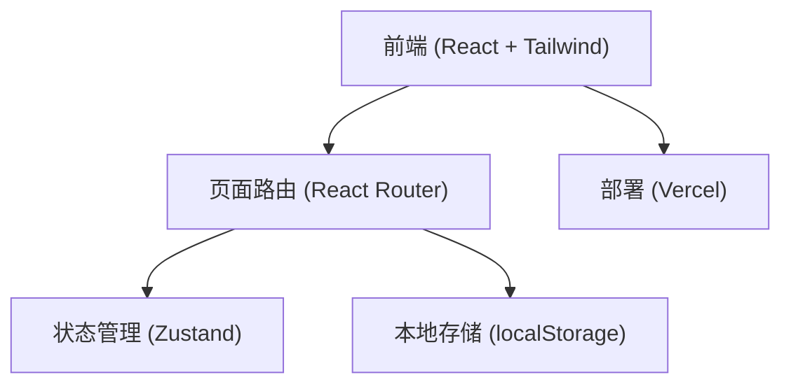
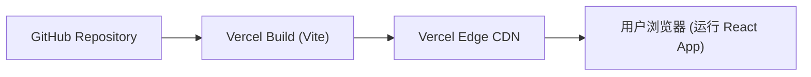
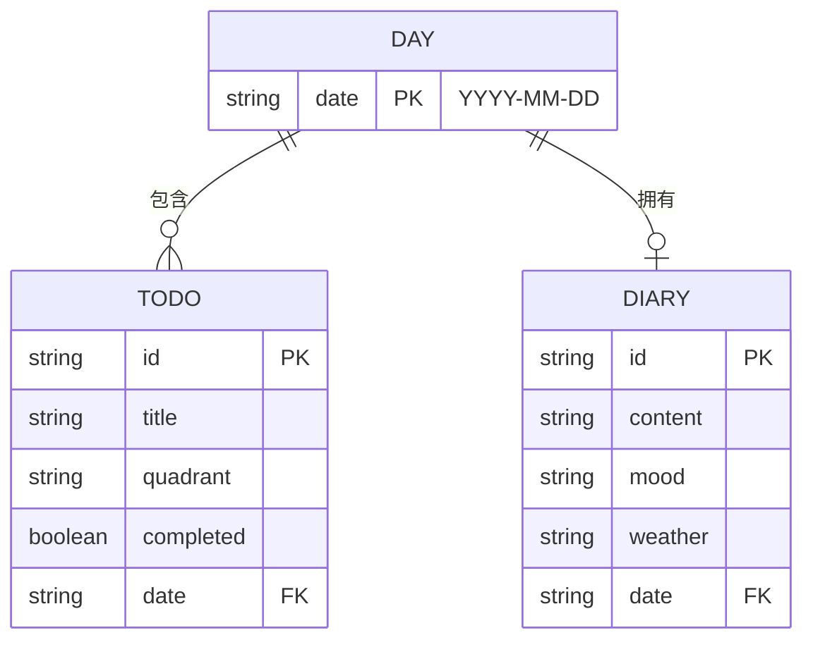

## 1. 架构设计


## 2. 技术说明
- 前端：React@18 + TailwindCSS@3 + Vite
- 状态管理：Zustand (轻量且适合管理跨页面的日记、待办数据，完美契合持久化)
- 动画库：Framer Motion (用于拖拽、页面切换和元素交互动画)
- 拖拽库：dnd-kit (用于四象限待办的拖拽移动)
- Markdown 解析：react-markdown + tailwindcss/typography
- 日期处理：date-fns
- 图标：lucide-react
- 初始化工具：vite
- 数据持久化：默认使用浏览器 localStorage 结合 Zustand persist 中间件，以保证数据在本地存留，纯前端架构极度契合 Vercel 的静态部署。

## 3. 路由定义
| 路由 | 用途 |
|-------|---------|
| `/` | 日历总览页 (Home) |
| `/todo` | 四象限待办页 |
| `/diary` | 图文日记页 |

## 4. API 定义 (本地状态接口)
```typescript
// 待办事项类型
interface Todo {
  id: string;
  title: string;
  quadrant: 'q1' | 'q2' | 'q3' | 'q4'; // 1:重要紧急 2:重要不紧急 3:不重要紧急 4:不重要不紧急
  date: string; // YYYY-MM-DD
  completed: boolean;
}

// 日记类型
interface Diary {
  id: string;
  date: string; // YYYY-MM-DD
  content: string; // Markdown
  mood: string;
  weather: string;
  images: string[];
}
```

## 5. 服务器架构图 (纯前端应用，部署于 Vercel)


## 6. 数据模型
### 6.1 数据模型定义

